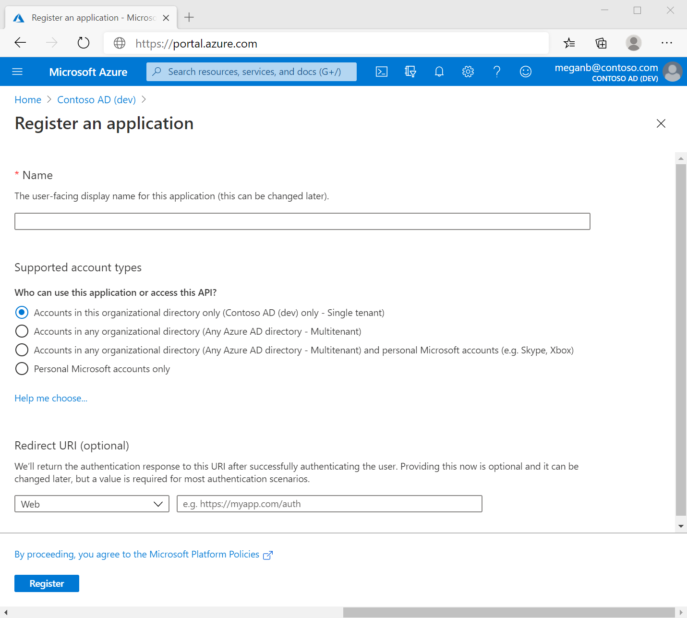

# Spring Swagger AAD Example
This project demonstrates how to setup a AAD protected API, exposes the Swagger UI and supports OAuth2 authoization from the Swagger UI for testing the API.

## Setup
Setting up the project requires configuring an AAD App Registration and configuring your API to use those settings. The settings are stored in the application.yaml file.
```
spring:
  profiles:
    active: @active.profile@

server:
  port: 8080

azure:
  activedirectory:
    tenant-id: <tenant-id>
    client-id: <client-id>
    client-secret: <client-secret>
    app-id-uri: <app-id-uri>
    token-request-endpoint: <endpoint>
    authorization-clients:
      graph:
        scopes:
          - https://graph.microsoft.com/User.Read
```
You can update the application.yaml file or you can create an application-local.yaml file to keep your settings seperate. To use local settings, create an application-local.yaml file and copy the azure section into it, then populate. When running your API you need to specify to use the local profile.

Using Maven: ``mvn spring-boot:run -Plocal``

Using VS Code: Add ``"vmArgs": "-Dspring.profiles.active=local"`` to your launch.json

## Application Registration
There is a good overview of Application registrations on the Microsoft [documentation](https://docs.microsoft.com/en-us/azure/active-directory/develop/quickstart-register-app).

1. Register your application. Select "Account in this organizational directory only" and leave the redirect URI blank. 

1. On the overview page you can pull the "Client ID" and "Tenant ID" 

1. On the Authentication tab you need to register a platform. Click "Add Platform" and select "Single Page App" (the embedded Swagger UI is treated like a SPA). For the redirect URI use `http://localhost:8080/webjars/springfox-swagger-ui/oauth2-redirect.html` 

1. On the "Certificates & Secrets" tab create a secret and populate the secret in your yaml file.

1. On the "API permissions" tab ensure the Graph API User.Read scope is defined and then click the "Grant Admin Consent" button. This is required because the API will call Graph API on behalf of the logged in user. 

1. On the "Expose an API" tab you need to create a scope for your API. In this example we will create a "read" scope to use. Click "Add a scope":
   1. Scope Name: read
   1. Who can consent?: Admins and Users
   1. Display Names/Descriptions: Read Data
   1. State: Enabled

    After the scope if registered, pull the Application URI ID and add it to the yaml file. 

1. The "token-request-endpoint" can be pulled from the Endpoint page on the Overview (click Endpoints at top of Overview) and use "OAuth 2.0 authorization endpoint (v2)"